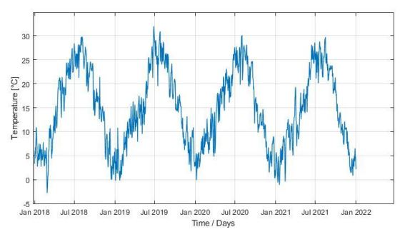
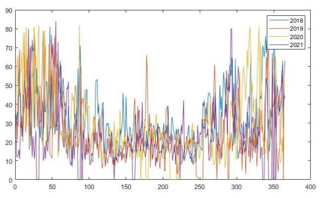

# Stochastic Prediction on MATLAB using Temperature and Pollutants Data

## 1 - OBSERVATION ANALYSIS

The observation analysis involves generating data in MATLAB, sampling a stationary random process, and introducing white noise. Parameters like sample size, observation epochs, and model characteristics are defined. The process includes creating covariance matrices, Cholesky decomposition, and sampling signals. A temperature time series from Milano Lambrate station is examined, revealing outliers and a clear yearly periodicity.

    

## 2 - EMPIRICAL COVARIANCE FUNCTION ESTIMATION WITH ARMA MODEL

To compute the empirical covariance function (ecf), deseasonalization of the data is performed using an ARMA model. The periodic mean and standard deviation are calculated and subtracted from the data. The ARMA model code is presented, and the resulting deseasonalized data is compared with the original dataset through plots, highlighting differences in biased and unbiased approaches. The unbiased ecf shows stability over time, contrasting with the biased ecf affected by drift.

## 3 - ECF LEAST SQUARE INTERPOLATION WITH AN EXPONENTIAL CF MODEL (ARMA MODEL DATASET)

To linearize the model, parameters are computed using either exact straight-line interpolation or exact interpolation with a polynomial of degree n. The intersection of the straight line interpolating covariance coefficients at steps 1 and 2 is determined, providing values for noise variance, correlation length, and decay factors. The estimation results are presented and potential issues with the dataset are highlighted.

## 4 - ECF AND LSI OF A CF MODEL USING THE DESEASONALIZED DFT DATASET

Unable to resolve issues with the ARMA model dataset, the deseasonalized dataset obtained from a colleague's DFT code is utilized. Interpolation is performed with both an exact straight line and a polynomial of degree two. After iterating once to refine the model parameters, estimation results are presented, highlighting challenges in subsequent iterations. Collocation is then employed for signal estimation, yielding a mean estimation error of 0.185298.

## 5 - STOCHASTIC PREDICTION USING PM10 DATA

After outlier removal from the PM10 dataset obtained from Milano Verziere, deseasonalization is carried out using the ARMA model. Empirical covariance function (ECF) computation, LS interpolation, and collocation estimation follow. The LS interpolation undergoes multiple iterations, optimizing parameters for a smoother, more accurate filtered signal. The collocated signal exhibits improved smoothness, with mean and std estimation errors of 0.030471 and 0.745783, respectively, surpassing results from the initial iteration.

    

